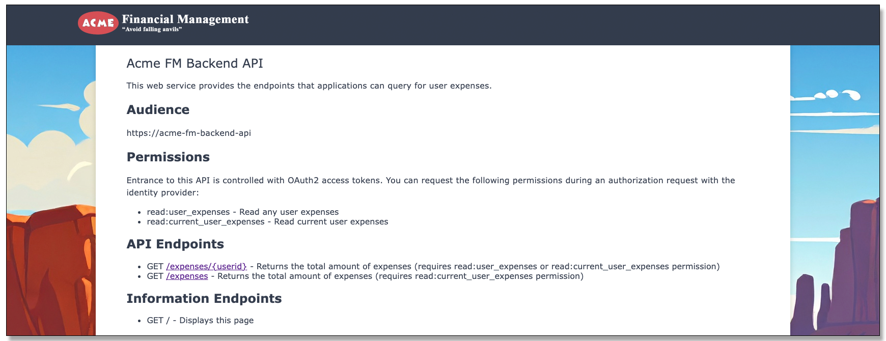
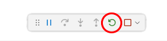
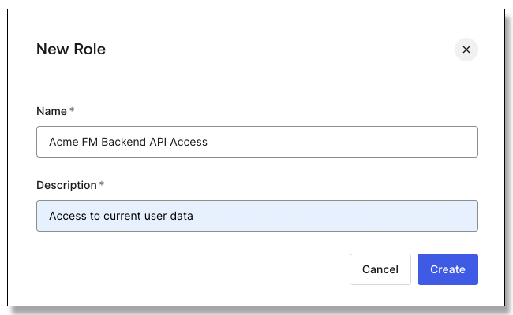

# Lab: API Access Management

## Dependencies

* The Auth0 integration for the ACME Financial Management application set up in part two of the
[Application Integration](https://github.com/auth0-sandbox/lab-app-integration) lab.

## Synopsis

This project explores leveraging the authorization request to obtain an access token for a
web service, also known as a *resource server* or *application programming interface (API)*.
This API will provide the expenses that were wired into the previous versions of the
Acme Financial Management application.

## Part 1: Setting up the API

1. In the Explorer panel locate the folder "Lab/API",
right-click, and choose *Open in Integrated Terminal*.

1. In the new terminal window use *npm* to install the dependency packages:

    ```bash
    $ npm install
    ```

1. In the *Explorer* locate the *Lab/API/src/server.js* file, right-click, and select *open to the side*.

1. Locate the *Lab/API/.env* file and double-click it to open.

1. Open the Auth0 tenant and locate the *Acme Financial Management* application.

1. On the *Settings* tab for the application find *Advanced Settings* at the bottom of the
    page and open it.

1. Switch to the *Endpoints* tab in *Advanced Settings* and copy the value for
    *JSON Web Key Set*.

1. Set the *JWKS_URI* variable in the .env file to the copied value (your URL will be different):
    ```js
    JWKS_URI=https://dev-lab-jmussman-20250714.us.auth0.com/.well-known/jwks.json
    ```

1. Build the *ISSUER* from the same value removing the path after the domain, but keep the trailing /
(your URL will be different):
    ```js
    ISSUER=https://dev-lab-jmussman-20250714.us.auth0.com/
    ```

    NOTE: Auth0 always uses https://{domain name}/ with the trailing slash at the issuer.
    If the issuer value the API gives to the SDK does not match *exactly*, requests are rejected.

1. Set the audience to this value:
    ```js
    AUDIENCE=https://acme-fm-backend-api
    ```

1. Save and close the .env file.

1. Open the *Run/Debug* panel from the VS Code toolbar.

1. Select the *Launch Backend API* launch configuration.

1. Click the run button next to the dropdown and launch the API.

1. Use the *View &rarr; Open View...* menu option to open the *DEBUG CONSOLE*
    if it was not opened already.
    The successful service start will print the URL the service is listening at.
    Use ctrl/cmd-click with the link to open the landing page for the API.

1. Verify that a landing page for the API is presented with documentation about its endpoints.
Click on the /expenses endpoint to make sure the application returns JSON data:

    <div style="text-align: center"></div>

    NOTE: clicking the /expenses/{userid} endpoint will result in a permission error.

1. In the terminal window add the package for verifying Auth0 access tokens:

    ```bash
    $ npm install express-oauth2-jwt-bearer
    ```

1. In the server.js file add an import statement to get the SDK for verifying Auth0 access tokens:
*auth* is the function that will build the express middleware from the configuration, and
*RequiredScopes* is added to the endpoint middleware to set which scopes are necessary for that endpoint.

    ```js
    import { auth, requiredScopes } from 'express-oauth2-jwt-bearer'
    ```

1. Locate the registration for the / endpoint:
    ```js
    app.get('/', (req, res) => {
        res.render("home", { })
    })
    ```

1. Add this registration after the / endpoint; the endpoints that follow this can require the access token and permissions:

    ```js
    app.use(auth({
        audience: process.env.AUDIENCE,
        issuer: process.env.ISSUER,
        jwksUri: process.env.JWKS_URI,
        tokenSigningAlg: process.env.TOKEN_SIGNING_ALG || 'RS256'
    }))
    ```

1. Locate the /expenses endpoint beginning with the code in this block:

    ```js
    app.get('/expenses', (req, res) => {...
    ```

1. Change the opening line of the registration by adding *RequiredScopes()* as the second
argument to *app.get*:

    ```js
    app.get('/expenses', requiredScopes('read:current_user_expenses'), (req, res) => {
    ```

1. Locate the middleware which serves expenses for a specific user and examine it:

    ```js
    app.get('/expenses/:userid', (req, res) => {
        if (req.auth
            && (req.auth.payload.scope.includes('read:user_expenses')
            || (req.auth.payload.sub === req.params.userid
            && !req.auth.payload.scope.includes('read:current_user_expenses')))) {
                res.json(expenses)
        } else {
            res.status(403).json({ error: 'Forbidden', message: 'Insufficient scope' })
        }
    })
    ```

    NOTE: This middleware uses a different approach.
    All requests are allowed in, but only requests for the current user with the read:current_user_expenses
    or any user with the read:user_expenses permission are allowed.

1. Save the server.js file.
    *nodemon* should restart the service automatically, or
    it may be restarted manually from the Run/Debug toolbar:

    <div style="text-align: center"></div>

1. From the API landing page make sure following the links to both endpoints are
    rejected with a permission problem because you are not providing an access token.
    You will see a JSON error message like this:

    ```json
    {"status":401,"message":"Unauthorized"}
    ```

1. Shut down the service with the stop button in the Run/Debug toolbar:

    <div style="text-align: center"></div>

## Part 2: Configure the API in the Auth0 tenant

1. In the Auth0 tenant use select *Applications &rarr; APIs*.

1. Click the *+ Create API* button to create a new API integration.

1. Name the new API *Acme FM Backend API*, and set the identifier to https://acme-fm-backend-api.
The identifier may be any string, often it is the public URL of the API.
This is also known as the "audience" in the application and the API itself.

    <div style="text-align: center;"></div>

1. Leave the JSON Web Token Profile and the Signing Algorithm as *Auth0* and *RS256*, and
click the *Create* button.

1. The Auth0 dashboard lands on the *Quickstart* tab for the new API.
Click on the *Settings* tab; here you can change the name of the API as it appears in the dashboard, the token
expiration, and the profile and signing algorithms.
The assigned ID and the Identifier (audience) cannot be changed.

    <div style="text-align: center;"></div>

1. Scroll down to *RBAC Settings*.
    Enable both *Enable RBAC* and *Add Permissions in the Access Token*.

    <div style="text-align: center;"></div>

1. Below under *Access Settings* enable both *Allow Skipping User Consent* and *Allow Offline Access*:

    <div style="text-align: center;"></div>

1. Click the *Save* button.

1. Switch to the *Permissions* tab.
Set the first permission to *read:current_user_expenses* with a description of *Read current user expense data*
and click the *+ Add* button:

    <div style="text-align: center;"></div>

1. Fill in a second permission as *read:user_expenses* and a description of *Read user expense data*, and
click the *+ Add* button.

1. NOTE: When you look under *Applications &rarr; Applications* some Auth0 tenants may automatically
    create an M2M test application with the same
    name as the API; this will be ignored in the labs.
    It may be safely deleted if you choose to:

    <div style="text-align: center;"></div>

## Part 3: Use Role-based Access Control (RBAC) to allow user access

Users may be assigned API permissions directly.
Usually users work in groups, and often everyone in the group requires the same access.
Also, users access changes during their lifecycle and roles work like groups.
Users may be added to and removed from roles and gain or loose access as that happens.

1. In the sidebar select *User Management &rarr; Roles*.

1. Click the *+ Create Role* button.
    Name the role *ACME Backend API Access* and make the description *Access to current user data*,
    then click the *Create* button.

    <div style="text-align: center;"></div>

1. The interface lands on the *Settings* tab for the role.
    Click on the *Permissions* tab.

1. Click the *Add Permissions* button.

1. Select the *ACME FM Backend API* created in the last section.
    Select just the *read:current_user_expenses* permission, and click the
    *Add Permissions* button:

    <div style="text-align: center;"></div>

1. Click the *Users* tab.

1. Click the *Add Users* button, and select *Will Notspend*.
    It is possible to type and select multiple users in this field.

    <div style="text-align: center"></div>

1. Once the user or users have been selected, click the *Assign* button.

## Part 4: Setting up the Acme application

1. The application needs to be set up as in the previous labs.
    Locate the *Lab/Acme* folder, right-click, and select *Open in integrated terminal*.

1. Run the npm command to install the dependencies:
    ```bash
    $ npm install
    ```

1. Locate the *Lab/Acme/.env* file and open it.
    If the files opens in the left panel, click-and-hold the tab and drag it to the right panel
    to make it easier to follow these instructions.

1. Set the *CLIENT_ID, CLIENT_SECRET,* and *ISSUER_BASE_URL* from the *Acme Financial Management*
    application in the Auth0 tenant as before.
    Remember to the ISSUER_BASE_URL is https://{your Auth0 domain name}.

1. Set the *BACKEND_AUDIENCE* and *BACKEND_URL* to these values:
    ```env
    BACKEND_AUDIENCE=https://acme-fm-backend-api
    BACKEND_URL=http://localhost:38500
    ```

    NOTE: The application is a web application running on the server, so the URL for the API is
    on the same server, localhost.
    Using the public URL is not necessary, and would be blocked by a firewall in production.

1. Save and close the .env file.

## Part 5: Obtain and use the access token in the application

1. In the Explorer panel find the *Lab/Acme/src/app.js* file and double-click to open it.

1. Locate the configuration for the Auth0 client that is registered as the Express middleware:
    ```js
    app.use(
        auth({
            issuerBaseURL: process.env.ISSUER_BASE_URL,
            baseURL: process.env.BASE_URL,
            clientID: process.env.CLIENT_ID,
            clientSecret: process.env.CLIENT_SECRET,
            ...
    ```

1. Add the following *audience* line to the existing *authorizationParams* section.
This configures the application to request a grant for an access token that matches the backend API we configured:

    <pre><code language="js"><span style="color: #aaaaaa;">authorizationParams: {</span><br>&nbsp;&nbsp;&nbsp;&nbsp;<span style="color: red">audience</span>: process.env.BACKEND_AUDIENCE,</code></pre>

    NOTE: We externalized the audience and URL values for the backend API in the environment.

1. Add this second line to the *authorizationParams* section to include the required scopes; *openid, profile,* and *email* must be included
t    o get the ID token properly:

    ```js
        scope: 'openid profile email read:current_user_expenses',
    ```

1. Just below locate the common function used for fetching results from the API:
    ```js
    async function fetchProtectedResource(req, url, method, body, headers) {
        if (!req.oidc || !req.oidc.accessToken) {
            throw new Error("User does not have an access token");
        }
        const options = {
            method: method || "GET",
            body: body ? JSON.stringify(body) : null,
            headers: new Headers({
                "Content-Type": "application/json",
                Accept: "application/json",
                ...headers,
            }),
        }
        const response = await fetch(url, options);
        if (!response.ok) {
            throw new Error(`Error from fetch: ${response.statusText}`)
        }
        return response;
    }
    ```

1. Locate the *headers* object in the *options*, and add the *Authorization* property to pass the bearer
    token as part of the API call between the *Accept* and *...headers* properties
    ```js
    headers: new Headers({
        "Content-Type": "application/json",
        Accept: "application/json",
        Authorization: `Bearer ${req.oidc.accessToken.access_token}`,
        ...headers,
    }),
    ```

    NOTE: grave accents (` over the tab key on the keyboard) are used around the JavaScript template literal (the value);
    they are not single-quotation marks!

1. Save the app.js file.
    
1. In the Run/Debug panel make sure *Launch Acme FM* is selected as the launch configuration and launch the program.

1. Click the Acme FM in the Call Stack on the Run/Debug panel.

1. In the DEBUG CONSOLE for the Acme FM application, locate the link to the application.

1. Only if inside a GitHub Codespace:
    1. Copy the link to the application.
    1. In the Auth0 settings for the Acme FM application paste the link as the logout URL.
    1. Paste the link with /callback appended as the callback URL.

1. Use the link to open the application page in the browser.

1. Sign on to the app with Will Notspend; this is the user that has the role with the API permissions.

1. The landing page will show an internal error talking to the API.
    The API is not running, we just want to make sure the app would launch first and verify the authentication provides the access token!

1. Click the name of the user on the landing page or the user icon at the upper right to
display the user information:

1. Hover over the second badge, the access token, and select *Inspect*:

    <div style="text-align: center;"></div>

1. This will launch the access token to decipher the contents at *https://jwt.io*.

1. Verify that the audience *https://acme-fm-backend-api* shows in the access token

1. Check that the permissions claim is in the token and has *read:current_user_expenses*.

1. Close the *jwt.io* tab in the browser.

1. Logout of the application.

1. Stop the application from the Run/Debug toolbar:

    <div style="text-align: center;"></div>

1. In the Run/Debug panel select the launch configuration "Launch All", and click the run button to launch
    both applications.

1. Both applications up in the *Call Stack* in the Run/Debug panel:

    <div style="text-align: center;"></div>

    Click on the first application and check the *DEBUG CONSOLE* panel to make sure the correct application
    is showing.
    Click the second application and check it shows in the *DEBUG CONSOLE*.

    NOTE: When you hover on a line, it shows the Run/Debug toolbar for that application, so you need to manage
    stopping and restarting each application from this window.

1. Sign on to the application with Will Notspend.
Verify that the after sign-on the total and count is displayed for the user!

    <div style="text-align: center;"></div>

1. Check the *Expenses* page to make sure the API is called to get the expenses.

## Part 6: The Auth0 Authorization API

1. Click on the *Tokens* menu item in the application.

1. Hover over the access token, the second badge, and pick *inspect* from the popup menu.

1. Note that Auth0 always adds the audience for the /userinfo endpoint at the authorization server to every
    token it issues.

1. In server.js locate the /userinfo endpoint registration:
    ```js
    app.get("/userinfo", async (req, res) => {...
    ```

1. Verify in the *try...catch* block that the API called is the
    authorization server /userinfo endpoint:
    ```js
    try {
        if (locals.user) {
            const apiUrl = `${process.env.ISSUER_BASE_URL}/userinfo`
    ```

1. Click on the *Userinfo* menu option and verify you see the JSON returned from
    the authorization server:

    <div style="text-align: center;"></div>

    NOTE: The single access token is being used to communicate with tow APIs: the backend API
    and the Auth0 Authorization API.
    This only works with this scenario because Auth0 always adds the Authorization API audience.
    For on-premises APIs only one may be requested at a time.

1. When you are finished exploring the application sign the user out with the *Logout* link.

1. Stop both applications with red square in the Run/Debug toolbar in VS Code (click it twice),
    or use the individual toolbars when you hover over the application in the *Call Stack*
    window in the Run/Debug Panel as was indicated in the previous instruction.

    <div style="text-align: center;"></div>

<br>
**Congratulations, you have completed this lab!**

If you are working inside a GitHub Codespace you may close and delete the Codespace.
If you are inside a Docker Container you may delete the docker container, and the image that
launched it.

## Troubleshooting

### The application or the API will not start

1. Check the .env file configuration
1. Check the DEBUG CONSOLE for error messages; check both applications

### The login screen does not show

1. Check the .env file configuration for the Acme application
1. Check the logs in the Auth0 tenant for messages
1. Check the JavaScript console in the Web Developer tools for bad URLs

### Internal error accessing the API

1. Make sure both the application and the API are currently running.
1. Confirm the application is requesting the correct audience, the API expects the correct audience, and the Auth0 tenant is configured with the correct audience.
1. Confirm the application .env has the correct URL for the API (http://localhost:38500).
1. Verify all the settings in the .env files for both the application and API.
1. Make sure the ISSUER variable for the API ends with a /.
1. Make sure that the permissions strings are correct in the Auth0 tenant, the application, and where authorization was added to the API.
1. Confirm that the user Will Notspend has the permissions assigned through the role.
